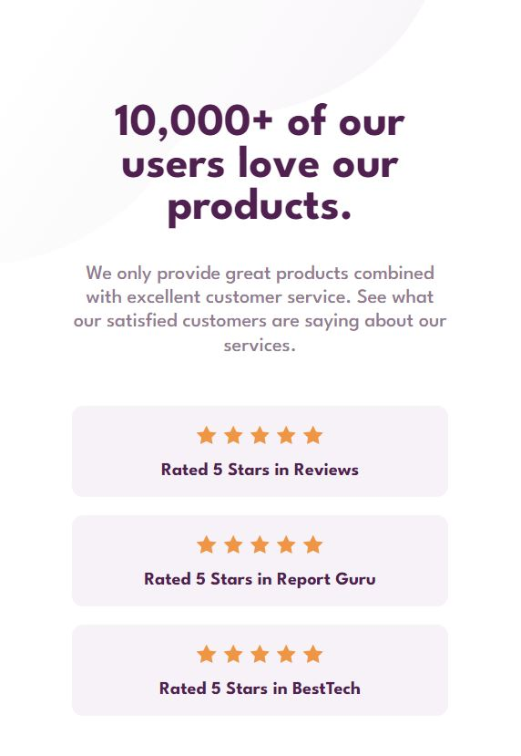

# Frontend Mentor - Social proof section solution

This is a solution to the [Social proof section challenge on Frontend Mentor](https://www.frontendmentor.io/challenges/social-proof-section-6e0qTv_bA).

## Table of contents

- [Overview](#overview)
  - [The challenge](#the-challenge)
  - [Screenshots](#screenshot)
  - [Link](#link)
- [My process](#my-process)
  - [Design](#design)
  - [Development](#development)
  - [Built with](#built-with)
  - [What I learned](#what-i-learned)

## Overview

This project is a dynamic and visually appealing rating and review system that showcases customers' satisfaction with their purchases. Constructed with HTML and CSS, it displays a 5-star rating for different review platforms and highlights reviews from verified customers. Each review is contained within an individual, easily readable component that includes the customer's name, a verified buyer badge, their photograph, and the full text of their review.

### The challenge

Users should be able to:

- View the optimal layout for the section depending on their device's screen size

### Screenshots

### Link

- Live Site URL: (social-proof-section-pk.netlify.app)

## My process

### Design

I was provided with a design for this project from Frontend Mentor. The design was clear and user-friendly. I had to recreate this design and bring it to life using HTML and CSS.

### Development

I started by structuring the HTML using semantic elements, and then styled the webpage with CSS, making use of variables for consistent colors. I made the website responsive by utilizing media queries and a mobile-first design approach.

### Built with

- Semantic HTML5 markup
- CSS custom properties
- Flexbox
- CSS Grid
- Mobile-first workflow

### What I learned

This project helped me strengthen my understanding of CSS Grid, media queries, and responsive design. I also gained practical experience in converting design files into functional webpages.

